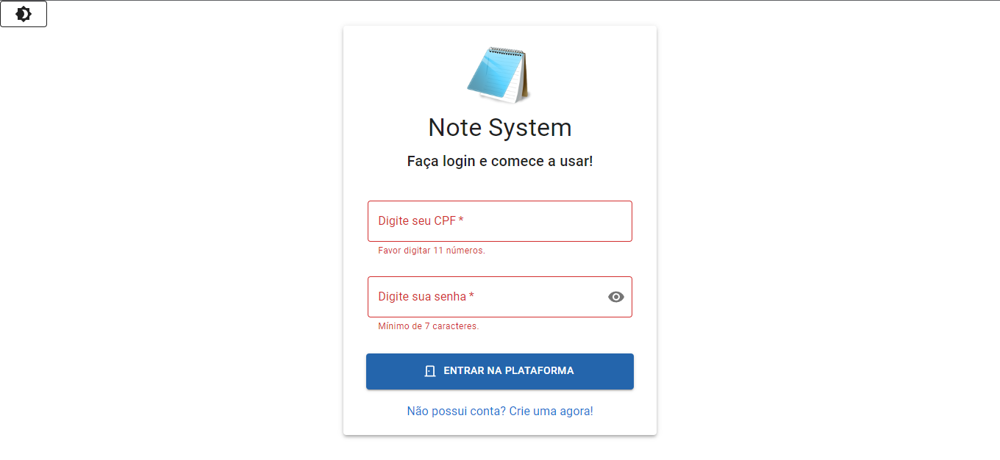
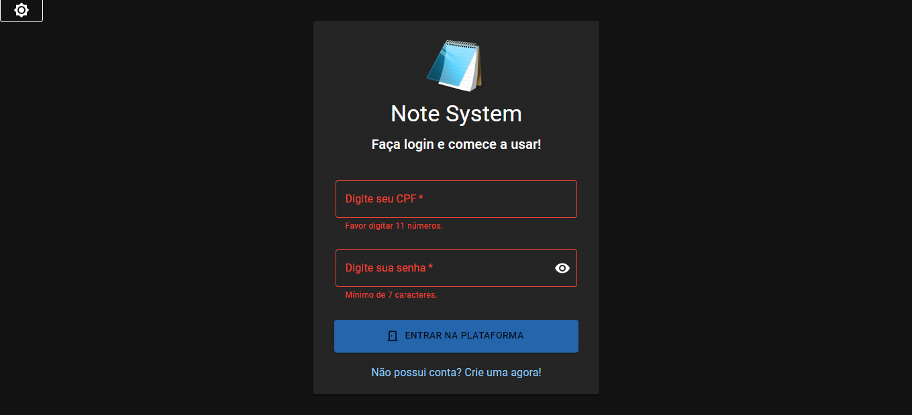
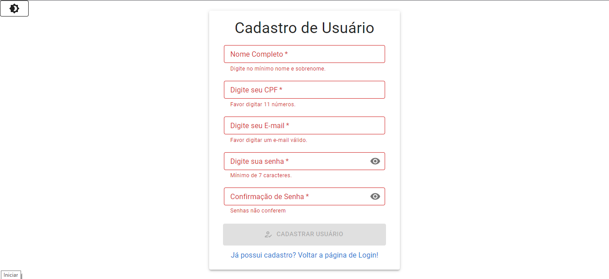
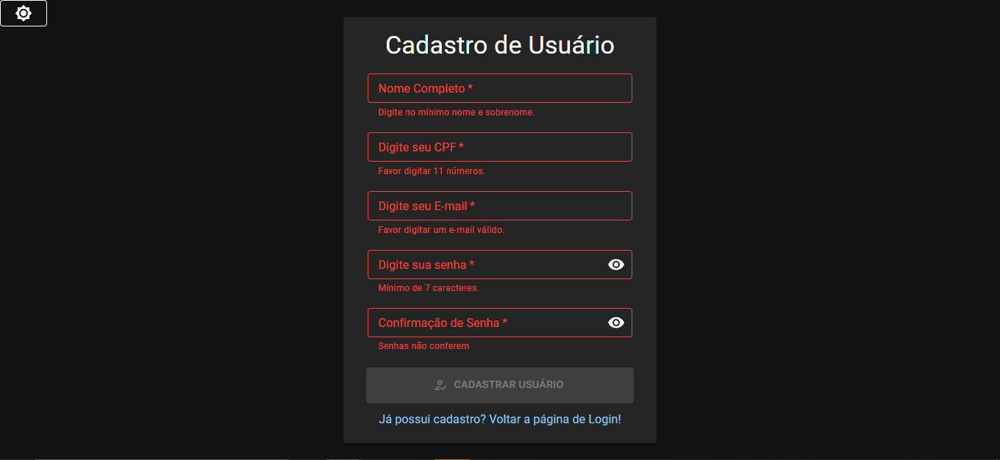
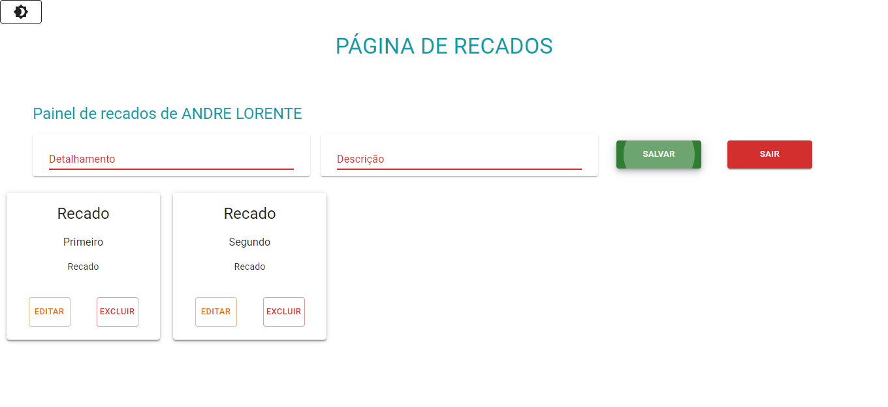
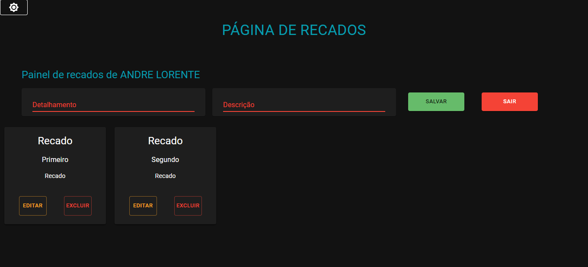

<h1 align="center"> Projeto Sistema de Recados </h1>

Projeto Final de Módulo Banco de Dados III - Growdev

  <a href="#-tecnologias">Tecnologias</a>&nbsp;&nbsp;&nbsp;|&nbsp;&nbsp;&nbsp;
  <a href="#-projeto">Projeto</a>&nbsp;&nbsp;&nbsp;|&nbsp;&nbsp;&nbsp;
  <a href="#-sistema">Sistema</a>&nbsp;&nbsp;&nbsp;|&nbsp;&nbsp;&nbsp;

 

  
  

  

  
  

  

  
  

  

## 🚀 Tecnologias

Esse projeto foi desenvolvido com as seguintes tecnologias:

- Typescript, ReactJS, Redux
- [MUI](https://mui.com/pt/material-ui/getting-started/overview/)
- [Node e NPM](https://nodejs.org/)
- [Redux Toolkit](https://redux-toolkit.js.org/usage/usage-guide)
- [Styled Components](https://styled-components.com/)

## 💻 Projeto

O Note System é uma simulação de sistema CRUD que armazena dados no Local Storagem com o Redux Persist, com React Router Dom você navega pelas páginas de Login, Cadastro e Recados. Podendo cadastrar multiplos usuários, bem como incluir,editar, arquivar e excluir uma lista de recados.

## 📓 Sistema

Trabalho final do Modulo Banco de Dados III da Growdev. Consumindo API NoteSystem_API_Arquitetura [API](https://github.com/Andreloren/NoteSystem_API_Arquitetura)
